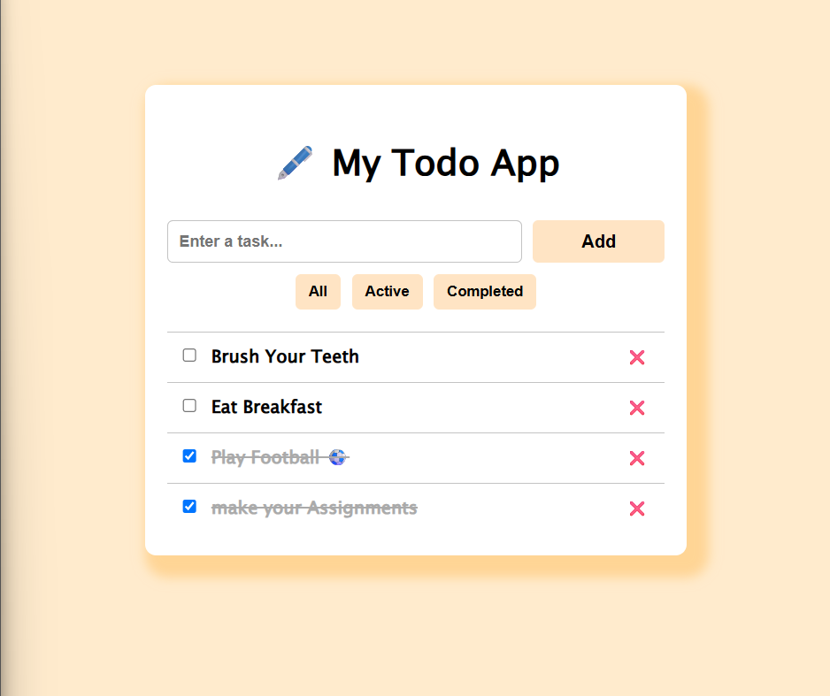

# 🐣 My-ToDo-App

A clean, responsive, and minimal Todo App built with **React**.  
Easily add, complete, delete, and filter your tasks with a smooth user experience.

---

## 🚀 Features

- Add new tasks with unique IDs
- Mark tasks as **active** or **completed**
- Filter tasks by **All**, **Active**, or **Completed**
- Delete tasks
- Responsive and modern UI
- Built using functional components and `useState`

---

## 🧠 What I Learned

This project helped reinforce several key React and JavaScript concepts:

- **Controlled components** using `useState`
- Generating **unique IDs** using `Date.now()` to avoid bugs from using array `index`
- Why **not** to use array index as a key when filtering or updating tasks:
  - Indexes shift when filtering
  - Causes wrong items to update/delete
- How to **conditionally render** components based on task status
- Reusable child component (`<Item />`) to represent a single task

### ❌ Tried and Failed Approaches:

- ❗ Using the `index` to update status or filter tasks resulted in incorrect behavior due to dynamic list changes.
- ❗ Filtering then mapping while using `index` broke task identification.

---

## 📸 Demo
https://mohammedyazji.github.io/my-todo-app/
=============================================

---

## 🛠️ Tech Stack

- **React** (CRA)
- **CSS** (Responsive using Flexbox)
- Clean and modular component structure

---
